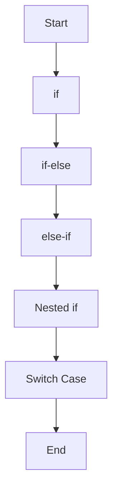
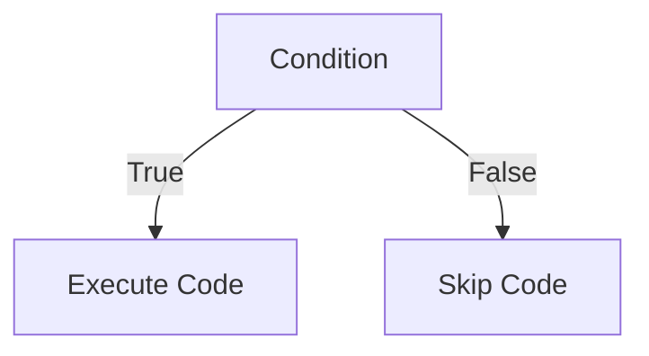
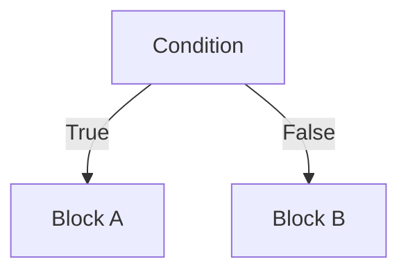
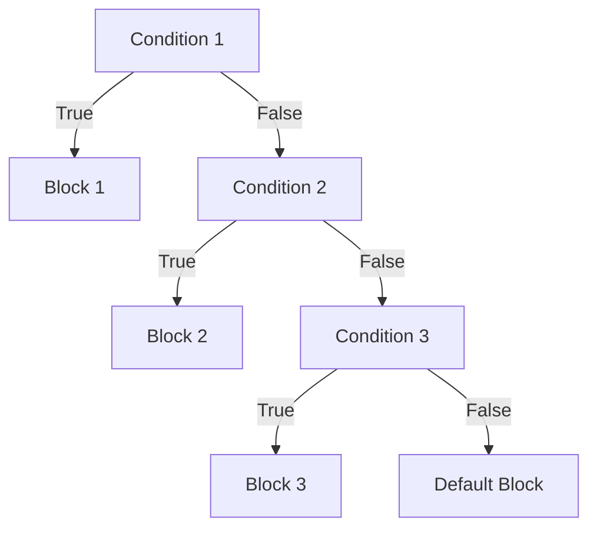
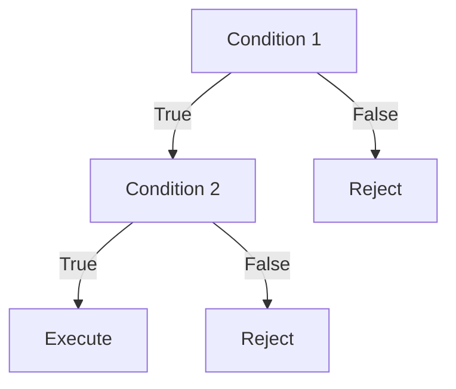
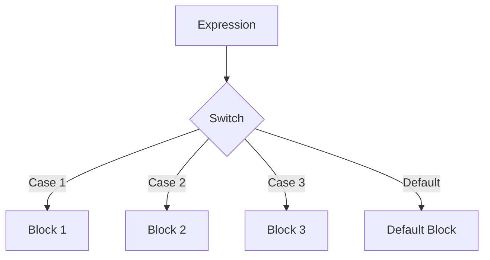
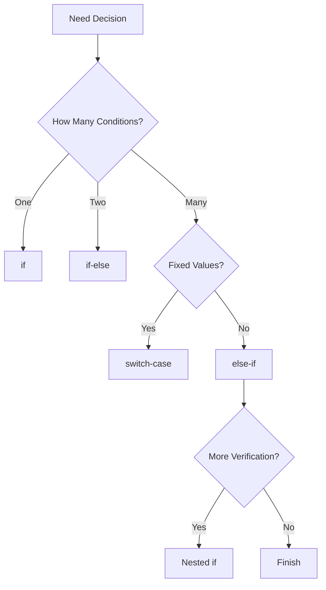

# 📘 03_Control_Flow - Dart Notes

> **Module:** 03_Control_Flow
> **Language:** Dart
> **Level:** Beginner → Intermediate
> **Programs:** 25+ Real-World Programs

---

# 📖 Introduction

Control Flow determines **how a program makes decisions** and **which block of code executes** based on different conditions.

Without control flow, every statement executes sequentially.

---

# 📚 Topics Covered

* if
* if-else
* else-if
* Nested if
* switch-case

---

# 🧠 Control Flow Roadmap



---

# 1️⃣ if Statement

## Definition

The **if statement** executes a block only when the condition is true.

### Syntax

```dart
if(condition){

    // code

}
```

### Flowchart



### Real World Examples

* ATM PIN Check
* Login
* Student Pass
* Discount
* Voting

---

# 2️⃣ if-else Statement

## Definition

When there are only **two possible outcomes**, use if-else.

### Syntax

```dart
if(condition){

}
else{

}
```

### Flowchart



### Examples

* Pass / Fail
* Login Success / Failure
* Eligible / Not Eligible
* Discount / No Discount

---

# 3️⃣ else-if Statement

## Definition

Used when there are multiple conditions.

### Syntax

```dart
if(){

}
else if(){

}
else{

}
```

### Flowchart



### Examples

* Grade System
* Salary Bonus
* Income Tax
* Temperature Checker
* Traffic Signal

---

# 4️⃣ Nested if

## Definition

A Nested if means **an if statement inside another if statement**.

### Syntax

```dart
if(){

    if(){

    }

}
```

### Flowchart



### Examples

* Login + OTP
* ATM Security
* Bank Loan
* College Admission

---

# 5️⃣ switch-case

## Definition

switch-case is used when one expression can have multiple fixed values.

### Syntax

```dart
switch(choice){

    case 1:

        break;

    default:

}
```

### Flowchart



### Examples

* ATM Menu
* Calculator Menu
* Language Selector
* Day Name
* Month Name

---

# 📊 Comparison

| Feature              | if | if-else | else-if | Nested if | switch-case           |
| -------------------- | -- | ------- | ------- | --------- | --------------------- |
| Single Condition     | ✅  | ✅       | ❌       | ❌         | ❌                     |
| Two Outcomes         | ❌  | ✅       | ❌       | ❌         | ❌                     |
| Multiple Conditions  | ❌  | ❌       | ✅       | ✅         | ✅ (fixed values only) |
| Complex Decision     | ❌  | ❌       | ✅       | ✅         | ❌                     |
| Menu Driven Programs | ❌  | ❌       | ❌       | ❌         | ✅                     |

---

# 🏗 Decision Tree



---

# 📁 Programs Included

## if

* if_voting.dart
* if_student_pass.dart
* if_atm.dart
* if_discount.dart
* if_login.dart

## if-else

* if_else_voting.dart
* if_else_student.dart
* if_else_atm.dart
* if_else_discount.dart
* if_else_login.dart

## else-if

* grade_system.dart
* traffic_signal.dart
* salary_bonus.dart
* income_tax.dart
* temperature_checker.dart

## Nested if

* login_system.dart
* atm_security.dart
* college_admission.dart
* shopping_order.dart
* bank_loan.dart

## switch-case

* day_name.dart
* month_name.dart
* atm_menu.dart
* calculator_menu.dart
* language_selector.dart

---

# 🎯 Interview Questions with Answers

## 1. What is Control Flow?

### Answer

**Control Flow** is the order in which the statements of a program are executed.

It allows a program to make decisions, repeat tasks, and execute different blocks of code depending on conditions.

**Example:**

* Login System
* ATM Machine
* Student Result

---

## 2. What is the difference between `if` and `if-else`?

| if                                        | if-else                                                                     |
| ----------------------------------------- | --------------------------------------------------------------------------- |
| Executes only when the condition is true. | Executes one block when the condition is true and another when it is false. |
| Used for single decision.                 | Used for two possible outcomes.                                             |

### Example

```dart
if (marks >= 33) {
    print("Pass");
}
```

```dart
if (marks >= 33) {
    print("Pass");
} else {
    print("Fail");
}
```

---

## 3. What is the difference between `else-if` and Nested `if`?

| else-if                                        | Nested if                                        |
| ---------------------------------------------- | ------------------------------------------------ |
| Used to check multiple independent conditions. | Used when one condition depends on another.      |
| Conditions are checked one by one.             | Second condition runs only if the first is true. |

### Example

### else-if

```dart
if (marks >= 90) {
    print("A");
} else if (marks >= 75) {
    print("B");
} else {
    print("C");
}
```

### Nested if

```dart
if (username == "nitin") {
    if (password == "1234") {
        print("Login Successful");
    }
}
```

---

## 4. When should `switch-case` be preferred?

### Answer

Use `switch-case` when:

* One variable has multiple fixed values.
* Building menu-driven applications.
* The logic depends on exact matches instead of ranges.

### Examples

* ATM Menu
* Language Selector
* Calculator Menu
* Day Name
* Month Name

---

## 5. Why is `break` used in `switch-case`?

### Answer

`break` immediately exits the `switch` statement after a matching case is executed.

Without `break`, the program would continue checking subsequent cases, which is generally not the desired behavior. In Dart, every non-empty case must terminate (for example with `break`, `return`, or `throw`).

### Example

```dart
case 1:
    print("Monday");
    break;
```

---

## 6. What is the purpose of `default`?

### Answer

The `default` block executes when no `case` matches the given value.

It is used to handle invalid or unexpected input.

### Example

```dart
default:
    print("Invalid Choice");
```

---

## 7. Can `switch-case` replace every `if-else`?

### Answer

**No.**

`switch-case` works best for matching fixed values.

It cannot replace `if-else` when conditions involve:

* `>`
* `<`
* `>=`
* `<=`
* Multiple logical conditions (`&&`, `||`)

For those situations, `if`, `if-else`, or `else-if` are better choices.

---

## 8. What are common mistakes while writing conditional statements?

### Answer

Some common mistakes are:

* Forgetting `break` inside a `switch`.
* Writing impossible or overlapping conditions.
* Not validating user input.
* Forgetting the `default` case in a `switch`.
* Creating deeply nested conditions that reduce readability.
* Using `switch` where `if-else` is more appropriate.

---

## 9. Explain Nested `if` with a real-world example.

### Answer

A **Nested `if`** is an `if` statement placed inside another `if`.

It is used when the second condition should be checked only after the first condition is true.

### Real-World Example

ATM Login

1. Check whether the card is inserted.
2. If the card is inserted, ask for the PIN.
3. If the PIN is correct, allow the transaction.

```dart
if (cardInserted) {
    if (pinCorrect) {
        print("Transaction Allowed");
    }
}
```

---

## 10. Which control statement is best for menu-driven programs?

### Answer

`switch-case` is generally the best choice for menu-driven programs because:

* It is easy to read.
* It is easy to maintain.
* Each menu option has its own `case`.
* Adding new menu options is straightforward.

### Examples

* ATM Menu
* Restaurant Menu
* Calculator Menu
* Language Selector
* Settings Menu

---

# ⭐ Interview Tips

* Explain concepts first, then give an example.
* Mention a real-world use case whenever possible.
* Know when to choose `if`, `if-else`, `else-if`, Nested `if`, and `switch-case`.
* Practice writing menu-driven programs using `switch-case`.
* Write clean, readable conditional logic with proper input validation.


# 📌 Summary

After completing this module, you can:

* Build decision-based applications.
* Create menu-driven console programs.
* Validate user input.
* Design login systems.
* Build ATM simulations.
* Create calculator and language selector menus.
* Solve beginner and intermediate conditional programming problems.

---

