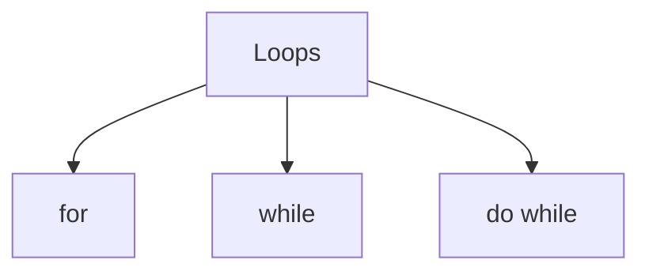
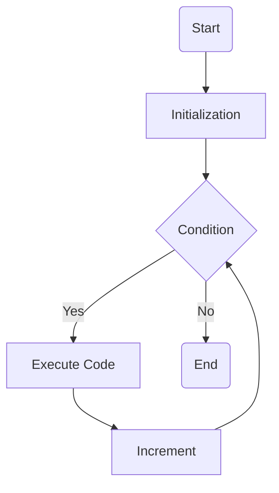
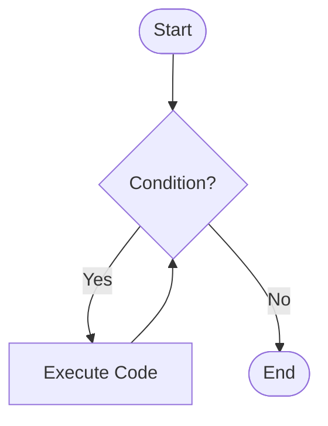
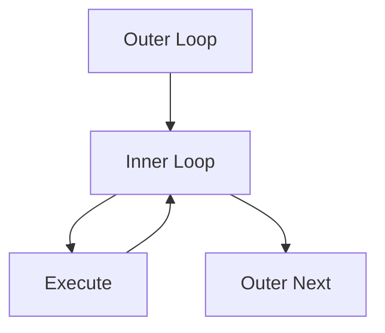

# 📘 Dart Notes
# Module 4 - Loops

> Language : Dart
> Level : Beginner → Intermediate
> Author : Nitin's Dart Course

---

# Table of Contents

1. Introduction
2. What is Loop?
3. Why Do We Need Loops?
4. Types of Loops
5. for Loop
6. while Loop
7. for vs while
8. Infinite Loop
9. Nested Loop
10. Real World Applications
11. Best Practices
12. Common Mistakes
13. Interview Questions
14. Practice Questions
15. Summary
16. Cheat Sheet

---

# 1. Introduction

Loop is one of the most important concepts in programming.

Imagine you have to print:

Hello
Hello
Hello
Hello
Hello

Without loops:

```dart
print("Hello");
print("Hello");
print("Hello");
print("Hello");
print("Hello");
```

This is called code duplication.

Using loops:

```dart
for(int i=1;i<=5;i++){
    print("Hello");
}
```

Only 3 lines of code.

That's why every programming language provides loops.

---

# 2. What is a Loop?

Definition

A loop is a programming structure that executes the same block of code repeatedly until a condition becomes false.

Simple Definition

Loop is used to repeat a block of code multiple times.

---

# 3. Why Do We Need Loops?

Without Loop

❌ Large Code
❌ Difficult to Read
❌ Difficult to Maintain
❌ Repeated Code

With Loop

✅ Short Code
✅ Clean Code
✅ Easy Maintenance
✅ Professional Programming

---

# Real World Example

Imagine a school has 500 students.

Without loop:

Read Student 1

Read Student 2

Read Student 3

...

Read Student 500

Impossible.

Using loop:

Repeat same task 500 times automatically.

---

# 4. Types of Loops in Dart

1. for Loop

2. while Loop

3. do...while Loop

We have completed

✅ for Loop

✅ while Loop

Next

➡ do...while

---

# Mermaid Diagram



---

# 5. for Loop

Definition

The for loop is used when the number of iterations is already known.

Example

Print numbers 1 to 100.

Print marks of 50 students.

Calculate salary of 30 employees.

Calculate bill of 100 customers.

Syntax

```dart
for(initialization;condition;increment){
    //code
}
```

---

# Parts of for Loop

```dart
for(int i=1;i<=5;i++)
```

Initialization

```dart
int i=1;
```

Runs only once.

Condition

```dart
i<=5
```

Checks whether loop should continue.

Increment

```dart
i++
```

Updates value after every iteration.

---

# Flow Diagram



---

# Dry Run

Example

```dart
for(int i=1;i<=3;i++){
    print(i);
}
```

Iteration 1

i=1

1<=3

True

Output

1

Iteration 2

i=2

2<=3

True

Output

2

Iteration 3

i=3

3<=3

True

Output

3

Iteration 4

i=4

4<=3

False

Loop Ends.

---

# Real World Applications

Student Attendance

Library System

Salary Calculator

Electricity Bill

Inventory Management

Sales Report

Marksheet

Employee Record

Restaurant Billing

Hospital Report

---

# Advantages

Easy

Fast

Clean

Professional

Reusable Logic

Less Code

Easy Maintenance

---

# Disadvantages

Not suitable if iterations are unknown.

---

# Example

```dart
for(int i=1;i<=10;i++){
    print(i);
}
```

---

# Reverse Loop

```dart
for(int i=10;i>=1;i--){
    print(i);
}
```

---

# Even Numbers

```dart
for(int i=2;i<=20;i+=2){
    print(i);
}
```

---

# Odd Numbers

```dart
for(int i=1;i<=19;i+=2){
    print(i);
}
```

---

# 6. while Loop

## Definition

The `while` loop is used when the number of iterations is **not known** before the program starts.

Simple Definition

> A `while` loop executes a block of code repeatedly as long as the condition is true.

---

# Syntax

```dart
while(condition){
    // code
}
```

---

# Flow Diagram



---

# Dry Run

Example

```dart
int i = 1;

while(i <= 3){
    print(i);
    i++;
}
```

### Iteration 1

i = 1

Condition

1 <= 3

True

Output

1

Increment

i = 2

---

### Iteration 2

i = 2

Condition

2 <= 3

True

Output

2

Increment

i = 3

---

### Iteration 3

i = 3

Condition

3 <= 3

True

Output

3

Increment

i = 4

---

### Iteration 4

i = 4

Condition

4 <= 3

False

Loop Ends.

---

# Real World Applications

ATM PIN Verification

OTP Verification

Student Login

Employee Login

Menu Driven Programs

Game Loop

Banking System

Password Verification

Captcha Verification

Shopping Cart Menu

---

# Advantages

Perfect when iterations are unknown.

Easy for validation systems.

Widely used in authentication systems.

Good for menu-driven programs.

---

# Disadvantages

Can easily become an infinite loop if the condition never becomes false.

---

# Example

```dart
int count = 1;

while(count <= 5){
    print("Welcome");
    count++;
}
```

---

# Infinite Loop

Definition

An infinite loop is a loop that never stops executing because its condition always remains true.

Example

```dart
while(true){
    print("Running...");
}
```

OR

```dart
int i = 1;

while(i <= 10){
    print(i);
}
```

Reason

Forgot to increment `i`.

---

# Nested Loop

Definition

A loop inside another loop is called a Nested Loop.

Example

```dart
for(int i = 1; i <= 3; i++){

    for(int j = 1; j <= 2; j++){
        print("$i $j");
    }

}
```

---

# Mermaid Diagram



---

# for vs while

| Feature | for | while |
|----------|-----|--------|
| Iterations | Known | Unknown |
| Initialization | Inside loop | Outside loop |
| Increment | Automatic position | Manual |
| Best For | Counting | Validation |
| Example | Print 1–100 | Login System |

---

# When to Use for?

✅ Print Numbers

✅ Student Marks

✅ Attendance

✅ Electricity Bill

✅ Salary Report

✅ Inventory

---

# When to Use while?

✅ ATM

✅ Login

✅ OTP

✅ Menu

✅ PIN Verification

✅ Password Checking

---

# Best Practices

✔ Use meaningful variable names.

✔ Avoid infinite loops.

✔ Keep loop body small.

✔ Update loop variable correctly.

✔ Choose the correct loop according to the problem.

---

# Common Mistakes

## 1. Forgetting Increment

```dart
while(i <= 10){
    print(i);
}
```

Infinite Loop.

---

## 2. Wrong Condition

```dart
for(int i = 1; i >= 10; i++)
```

Loop never executes.

---

## 3. Wrong Increment

```dart
for(int i = 1; i <= 10; i--)
```

Infinite Loop.

---

## 4. Changing Wrong Variable

Always update the correct loop variable.

---

# Real World Programs We Built

### for Loop

✅ Library Fine System

✅ Student Attendance System

✅ Electricity Bill Calculator

---

### while Loop

✅ ATM PIN Verification

✅ OTP Verification

✅ Student Login System

---

# Interview Questions

## Basic Level

### 1. What is a loop?

A loop executes a block of code repeatedly.

---

### 2. Why do we use loops?

To reduce code duplication and automate repetitive tasks.

---

### 3. How many loops are available in Dart?

- for
- while
- do...while

---

### 4. When should we use a for loop?

When the number of iterations is known.

---

### 5. When should we use a while loop?

When the number of iterations is unknown.

---

### 6. What is an infinite loop?

A loop that never terminates because its condition is always true.

---

### 7. What is a nested loop?

A loop inside another loop.

---

### 8. Difference between for and while?

for → Known iterations

while → Unknown iterations

---

### 9. Which loop is faster?

Both are nearly the same. Performance difference is negligible. Choose based on the problem.

---

### 10. Give real-world examples of loops.

Student Attendance

ATM

OTP

Login

Salary

Electricity Bill

Inventory

Library

Hospital

Restaurant Billing

---

### 11. Can a while loop replace a for loop?

Yes. Most `for` loops can be rewritten using `while`, but `for` is usually clearer for counting.

---

### 12. Can a loop run zero times?

Yes. If the condition is false at the start, `for` and `while` execute zero times.

---

# Practice Questions

## Easy

1. Print 1–100.

2. Print even numbers.

3. Print odd numbers.

4. Reverse counting.

5. Sum of first 100 numbers.

---

## Medium

6. Multiplication Table.

7. Factorial.

8. Fibonacci Series.

9. Prime Numbers.

10. Armstrong Number.

---

## Real World

11. ATM PIN Verification

12. Student Login

13. OTP Verification

14. Electricity Bill

15. Salary Calculator

16. Library Fine System

17. Attendance Report

18. Restaurant Billing

19. Shopping Cart

20. Bank Account Menu

---

# Summary

Loops help us repeat code efficiently.

### for Loop

- Known iterations
- Counter-based

### while Loop

- Unknown iterations
- Condition-based

### Nested Loop

- Loop inside another loop

### Infinite Loop

- Condition never becomes false

---

# Cheat Sheet

```text
LOOPS
│
├── for
│     ├── Known Iterations
│     ├── Counter Based
│     ├── Student Marks
│     ├── Salary
│     └── Electricity Bill
│
├── while
│     ├── Unknown Iterations
│     ├── Condition Based
│     ├── ATM
│     ├── OTP
│     ├── Login
│     └── Menu
│
├── Nested Loop
│     └── Loop inside Loop
│
└── Infinite Loop
      └── Condition always true
```

---

# Module 4 Status

✅ for Loop Completed

✅ while Loop Completed

---

# 13. Interview Questions & Answers

## Basic Level Questions

### Q1. What is a loop?

**Answer**

A loop is a programming structure used to execute a block of code repeatedly until a specified condition becomes false.

---

### Q2. Why do we use loops?

**Answer**

Loops are used to:

- Reduce code duplication
- Save development time
- Execute repetitive tasks
- Improve code readability
- Make programs easier to maintain

---

### Q3. How many types of loops are available in Dart?

**Answer**

There are three types:

- for
- while
- do...while

---

### Q4. What is a for loop?

**Answer**

A `for` loop is used when the number of iterations is known before execution.

---

### Q5. What is a while loop?

**Answer**

A `while` loop is used when the number of iterations is not known in advance.

---

### Q6. What is a do...while loop?

**Answer**

A `do...while` loop executes the code at least one time before checking the condition.

---

### Q7. What is an iteration?

**Answer**

One complete execution of the loop body is called an iteration.

---

### Q8. What is loop initialization?

**Answer**

Initialization sets the starting value of the loop variable.

Example:

```dart
int i = 1;
```

---

### Q9. What is a loop condition?

**Answer**

The condition decides whether the loop should continue or stop.

---

### Q10. What is increment/decrement?

**Answer**

It updates the loop variable after each iteration.

Example:

```dart
i++;
```

or

```dart
i--;
```

---

# Intermediate Questions

### Q11. What is an infinite loop?

**Answer**

A loop that never terminates because its condition always remains true.

Example:

```dart
while(true){

}
```

---

### Q12. How do you avoid an infinite loop?

**Answer**

- Update the loop variable.
- Write the correct condition.
- Test edge cases.

---

### Q13. Can a loop execute zero times?

**Answer**

Yes.

If the condition is false initially, both `for` and `while` loops execute zero times.

---

### Q14. Which loop always executes at least once?

**Answer**

`do...while` loop.

---

### Q15. Can every for loop be converted into a while loop?

**Answer**

Yes.

Most `for` loops can be rewritten using a `while` loop.

---

### Q16. Can every while loop be converted into a for loop?

**Answer**

Yes, in many cases, but `while` is often more readable for unknown iterations.

---

### Q17. What is a nested loop?

**Answer**

A loop inside another loop is called a nested loop.

---

### Q18. Where are nested loops used?

**Answer**

- Matrix operations
- Pattern printing
- Chess boards
- Seating arrangements
- Multiplication tables

---

### Q19. Which loop is better?

**Answer**

Neither.

Use the one that best matches the problem.

---

### Q20. Which loop is faster?

**Answer**

There is almost no practical performance difference between `for` and `while`.

The choice depends on readability and problem requirements.

---

# Scenario-Based Questions

### Q21. Which loop is best for ATM PIN verification?

**Answer**

`while`

Because the number of attempts depends on user input.

---

### Q22. Which loop is best for OTP verification?

**Answer**

`while`

The user may enter the OTP multiple times until success or attempts are exhausted.

---

### Q23. Which loop is best for a login system?

**Answer**

`while`

The loop continues until the user logs in successfully or exceeds the allowed attempts.

---

### Q24. Which loop is best for printing numbers from 1 to 100?

**Answer**

`for`

Because the number of iterations is fixed.

---

### Q25. Which loop is best for an electricity bill program for 100 customers?

**Answer**

`for`

Exactly 100 customers need to be processed.

---

### Q26. Which loop is suitable for a menu-driven program?

**Answer**

`while`

The menu repeats until the user chooses Exit.

---

### Q27. Which loop is suitable for a game loop?

**Answer**

`while`

The game keeps running until the player quits or the game ends.

---

# Debugging Questions

### Q28. Find the mistake.

```dart
int i = 1;

while(i <= 5){
    print(i);
}
```

**Answer**

Missing:

```dart
i++;
```

Otherwise, the loop becomes infinite.

---

### Q29. Why doesn't this loop execute?

```dart
for(int i = 10; i < 1; i++){
    print(i);
}
```

**Answer**

The initial condition is already false (`10 < 1`), so the loop body never runs.

---

### Q30. What's wrong here?

```dart
for(int i = 1; i <= 10; i--){
```

**Answer**

The loop decrements instead of increments, causing an infinite loop.

---

# Output-Based Questions

### Q31. Output?

```dart
for(int i = 1; i <= 3; i++){
    print(i);
}
```

**Answer**

```text
1
2
3
```

---

### Q32. Output?

```dart
int i = 3;

while(i > 0){
    print(i);
    i--;
}
```

**Answer**

```text
3
2
1
```

---

### Q33. How many times will this execute?

```dart
for(int i = 1; i <= 5; i++)
```

**Answer**

5 times.

---

### Q34. Can a loop have more than one statement?

**Answer**

Yes.

Use braces `{}`.

---

### Q35. Can a loop be empty?

**Answer**

Yes.

Example:

```dart
for(int i = 0; i < 10; i++){}
```

---

# Advanced Beginner Questions

### Q36. What is loop control?

**Answer**

Loop control determines how many times a loop executes and when it stops.

---

### Q37. Why is the loop condition important?

**Answer**

It prevents infinite loops and controls program flow.

---

### Q38. Why should variable names be meaningful?

**Answer**

Meaningful names improve readability and maintenance.

Example:

```dart
customerCount
```

is better than

```dart
x
```

---

### Q39. Name five real-world applications of loops.

**Answer**

- ATM
- Login System
- OTP Verification
- Attendance System
- Salary Calculator

---

### Q40. Where are loops used in Flutter?

**Answer**

Loops are commonly used for:

- Displaying lists
- Generating widgets
- Reading API data
- Processing JSON
- Building menus
- Displaying products
- Rendering chat messages

---

# Frequently Asked by Interviewers

✔ Difference between for and while

✔ Infinite Loop

✔ Nested Loop

✔ Real-world examples

✔ Loop execution flow

✔ Dry run

✔ Predict the output

✔ Find the error

✔ Time complexity of loops

✔ Menu-driven programming

---

# Interview Tips

✔ Choose the correct loop according to the problem.

✔ Explain with a real-world example.

✔ Mention infinite loop prevention.

✔ Speak confidently.

✔ Write clean code with proper indentation.

✔ Practice dry runs before interviews.

---

# End of Module 4

Congratulations 🎉

You have successfully completed:

- ✅ for Loop
- ✅ while Loop
- ✅ Loop Flow
- ✅ Mermaid Diagrams
- ✅ Real-World Programs
- ✅ 40 Interview Questions

