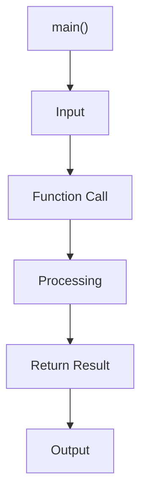

# 🚀 Dart Functions

> Complete Notes for Beginners to Professional Level

---

# 📖 What is a Function?

A **Function** is a reusable block of code that performs a specific task.

Instead of writing the same code multiple times, we write it once inside a function and call it whenever needed.

---

# 🤔 Why Do We Use Functions?

Without functions:

* Code becomes lengthy.
* Same code is written repeatedly.
* Maintenance becomes difficult.

With functions:

* Code becomes reusable.
* Easy to read.
* Easy to debug.
* Easy to maintain.

---

# 🎯 Advantages of Functions

* Code Reusability
* Better Readability
* Easy Maintenance
* Reduces Code Duplication
* Easy Debugging
* Improves Code Organization
* Makes Large Projects Easy to Manage

---

# ❌ Disadvantages of Functions

* Too many small functions can make navigation difficult.
* Poor function names reduce readability.
* Excessive function calls may have a small performance cost.

---

# 🏗 Function Syntax

```dart
returnType functionName(parameters) {

    // Code

}
```

Example

```dart
void greet() {

    print("Hello");

}
```

---

# 🧩 Parts of a Function

```dart
void greet(String name) {

    print(name);

}
```

* `void` → Return Type
* `greet` → Function Name
* `String name` → Parameter
* `{ }` → Function Body

---

# 🔥 Types of Functions

## 1. No Parameter, No Return

```dart
void welcome() {

    print("Welcome");

}
```

---

## 2. Parameter, No Return

```dart
void welcome(String name) {

    print("Welcome $name");

}
```

---

## 3. Parameter, Return

```dart
int add(int a, int b) {

    return a + b;

}
```

---

## 4. No Parameter, Return

```dart
String collegeName() {

    return "DIET";

}
```

---

# 📥 Parameters

A parameter is a variable used in a function to receive data.

Example

```dart
void student(String name) {

}
```

Here,

`name` is the parameter.

---

# 📤 Arguments

An argument is the actual value passed to a function.

```dart
student("Nitin");
```

Here,

`"Nitin"` is the argument.

---

# 📊 Parameter vs Argument

| Parameter            | Argument             |
| -------------------- | -------------------- |
| Declared in function | Passed while calling |
| Variable             | Actual Value         |
| Receives Data        | Sends Data           |

---

# 🔄 Return Keyword

The `return` keyword sends a value back to the caller.

Example

```dart
int square(int number) {

    return number * number;

}
```

---

# 🔄 Function Call Flow


---

# 🌍 Real World Uses of Functions

* ATM Machine
* Banking Software
* Hospital Management System
* Student Result System
* Restaurant Billing
* Shopping Cart
* Hotel Booking
* Payroll System
* Railway Reservation
* Online Payment System

---

# 💡 Best Practices

* Use meaningful function names.
* One function should perform one task.
* Keep functions short.
* Avoid duplicate code.
* Use return values whenever required.
* Pass only required parameters.

---

# ❌ Common Mistakes

* Forgetting to call a function.
* Wrong parameter order.
* Returning the wrong data type.
* Missing `return` statement.
* Writing all logic inside `main()`.

---

# 📋 Cheat Sheet

```text
void functionName(){}

int add(int a,int b){}

double calculate(){}

String name(){}

bool isValid(){}

return value;

functionName();

result = add(10,20);
```

---

# 🎤 Interview Questions with Answers

## 1. What is a function?

A function is a reusable block of code that performs a specific task.

---

## 2. Why do we use functions?

To avoid code duplication and improve code reusability.

---

## 3. What is function calling?

Executing a function using its name.

---

## 4. What is a parameter?

A variable used to receive data inside a function.

---

## 5. What is an argument?

The actual value passed while calling a function.

---

## 6. Difference between parameter and argument?

A parameter receives data, while an argument sends data.

---

## 7. What is a return type?

The data type returned by a function.

---

## 8. What is `void`?

It means the function does not return any value.

---

## 9. Can a function return multiple values?

No. A function returns one value directly. (Multiple values can be grouped using objects, records, or collections.)

---

## 10. Can a function have multiple parameters?

Yes.

---

## 11. Can a function have zero parameters?

Yes.

---

## 12. Can a function return nothing?

Yes. Use `void`.

---

## 13. What is code reusability?

Writing code once and using it multiple times.

---

## 14. Why are functions important?

They make programs organized, reusable, and maintainable.

---

## 15. What happens when a function is called?

Program control moves to the function, executes its code, and then returns to the caller.

---

## 16. What is a function signature?

The combination of the function name, parameters, and return type.

---

## 17. Can one function call another function?

Yes.

---

## 18. What is recursion?

A function calling itself.

---

## 19. What is the scope of a parameter?

It is available only inside that function.

---

## 20. Can functions improve readability?

Yes.

---

## 21. What is the main advantage of functions?

Code reusability.

---

## 22. What keyword is used to return a value?

`return`

---

## 23. What happens after `return` executes?

The function ends immediately and control goes back to the caller.

---

## 24. Can a return statement appear inside an `if` block?

Yes.

---

## 25. Can a function be called multiple times?

Yes.

---

## 26. What is a caller function?

The function that calls another function.

---

## 27. Which function starts execution in Dart?

`main()`

---

## 28. Can `main()` call other functions?

Yes.

---

## 29. Why should functions have meaningful names?

To improve readability and maintenance.

---

## 30. Is it good practice to write all code inside `main()`?

No. Business logic should be divided into separate functions.

---

# 📝 Practice Questions

### Basic

1. Create a function to print your name.
2. Create a function to print your college.
3. Create a function to return your city.
4. Create a function to calculate the square of a number.
5. Create a function to calculate the cube of a number.

### Intermediate

6. Employee Salary Calculator
7. Electricity Bill System
8. Shopping Bill with GST
9. Student Result System
10. Bank Interest Calculator

### Advanced

11. Payroll Management System
12. Hotel Booking System
13. Hospital Billing System
14. Railway Ticket System
15. Online Food Delivery Billing

---

# 🏁 Summary

* A function is a reusable block of code.
* Functions improve readability and maintainability.
* Parameters receive values.
* Arguments pass values.
* `return` sends a value back to the caller.
* `void` means no value is returned.
* Functions are the foundation of professional software development and are heavily used in Flutter applications.
