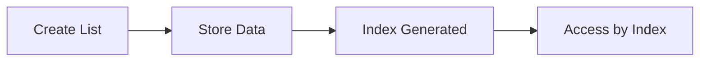
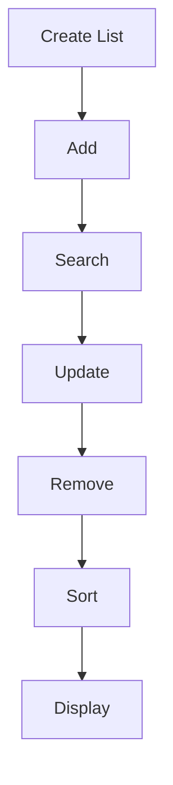

# 📘 Dart List Notes

> Complete Guide to Dart List (Part 1)

---

# What is List?

A **List** is an ordered collection of elements.

* Stores multiple values in one variable.
* Uses **Zero-Based Indexing**.
* Allows duplicate values.
* Can be growable or fixed.
* Stores elements in insertion order.

Example

```dart
List<String> names = [
    "Rahul",
    "Nitin",
    "Aman"
];
```

---

# Why List?

Without List

```dart
String student1 = "Rahul";
String student2 = "Nitin";
String student3 = "Aman";
```

With List

```dart
List<String> students = [
    "Rahul",
    "Nitin",
    "Aman"
];
```

Advantages

* Less Code
* Easy Management
* Easy Searching
* Easy Updating
* Easy Looping
* Easy Sorting

---

# Features

| Feature          | Supported |
| ---------------- | --------- |
| Ordered          | ✅         |
| Indexed          | ✅         |
| Duplicate Values | ✅         |
| Growable         | ✅         |
| Fixed Length     | ✅         |
| Generic          | ✅         |
| Dynamic          | ✅         |

---

# Internal Working



---

# Memory Representation

```text
Index

0      1      2

↓

+--------+--------+--------+

| Rahul  | Nitin  | Aman   |

+--------+--------+--------+
```

---

# List Syntax

General Syntax

```dart
List<DataType> variableName = [];
```

Example

```dart
List<int> numbers = [];
```

---

# Generic List

Generic specifies which datatype can be stored.

Syntax

```dart
List<String> names = [];
```

Example

```dart
names.add("Rahul");
names.add("Aman");
```

❌ Wrong

```dart
names.add(100);
```

Examples

```dart
List<int> marks = [];

List<double> salary = [];

List<bool> answers = [];

List<String> cities = [];

List<Object> items = [];
```

---

# Dynamic List

Stores different datatypes.

Syntax

```dart
List data = [];
```

Example

```dart
data.add("Rahul");

data.add(100);

data.add(true);

data.add(50.5);
```

Output

```text
Rahul
100
true
50.5
```

⚠ Avoid Dynamic whenever possible.

---

# Nullable List

Stores null values.

```dart
List<String?> names = [];
```

Example

```dart
names.add("Rahul");

names.add(null);

names.add("Aman");
```

---

# Non Nullable List

```dart
List<String> names = [];
```

Wrong

```dart
names.add(null);
```

Compile Error

---

# Creating List

## Empty List

```dart
List<String> names = [];
```

---

## List with Values

```dart
List<int> numbers = [
    10,
    20,
    30
];
```

---

## Using var

```dart
var names = <String>[];
```

---

# Types of List

## 1. Growable List

Size can increase or decrease.

```dart
List<int> numbers = [];

numbers.add(10);

numbers.add(20);

numbers.remove(10);
```

Supports

* add()
* remove()
* insert()
* clear()

---

## 2. Fixed Length List

Size cannot change.

```dart
List<int> numbers = List.filled(
    5,
    0,
);
```

Memory

```text
0 0 0 0 0
```

Updating is allowed

```dart
numbers[0] = 100;
```

Adding is NOT allowed

```dart
numbers.add(10);
```

Runtime Error

---

# List Constructors

## 1. List.empty()

Creates an empty list.

Syntax

```dart
List.empty(
    growable: true,
);
```

Example

```dart
List<String> names =
    List.empty(
        growable: true,
    );
```

---

## 2. List.filled()

Creates a list with fixed size and same value.

Syntax

```dart
List.filled(
    length,
    value,
);
```

Example

```dart
List<int> marks =
    List.filled(
        5,
        0,
    );
```

Output

```text
[0, 0, 0, 0, 0]
```

---

## 3. List.generate()

Creates values automatically.

Syntax

```dart
List.generate(
    length,
    generator,
);
```

Example

```dart
List<int> numbers =
    List.generate(
        5,
        (index) => index + 1,
    );
```

Output

```text
[1,2,3,4,5]
```

---

## 4. List.from()

Creates a new list from another iterable.

Syntax

```dart
List.from(iterable);
```

Example

```dart
List<int> a = [
    10,
    20,
    30
];

List<int> b =
    List.from(a);
```

---

## 5. List.of()

Similar to List.from().

Syntax

```dart
List.of(iterable);
```

Example

```dart
List<String> names =
    List.of([
        "Rahul",
        "Aman"
    ]);
```

---

## 6. List.unmodifiable()

Creates a read-only list.

Syntax

```dart
List.unmodifiable(
    iterable,
);
```

Example

```dart
final names =
    List.unmodifiable([
        "Rahul",
        "Aman"
    ]);
```

Wrong

```dart
names.add("Nitin");
```

Runtime Error

---

# Constructor Comparison

| Constructor         | Growable | Editable          |
| ------------------- | -------- | ----------------- |
| []                  | ✅        | ✅                 |
| List.empty()        | Depends  | ✅                 |
| List.filled()       | ❌        | Value Update Only |
| List.generate()     | ✅        | ✅                 |
| List.from()         | ✅        | ✅                 |
| List.of()           | ✅        | ✅                 |
| List.unmodifiable() | ❌        | ❌                 |

---

# Best Practices

* Always use Generic.
* Prefer Growable List.
* Avoid Dynamic.
* Use meaningful variable names.
* Use `final` if list reference will not change.

---

# Common Mistakes

Wrong datatype

```dart
List<int> marks = [];

marks.add("90");
```

Wrong index

```dart
numbers[10];
```

Using add() on fixed list

```dart
List.filled(5, 0).add(10);
```

Using null in non-nullable list

```dart
List<String> names = [];

names.add(null);
```

---

# Mermaid Mind Map

```mermaid
mindmap
root((List))

Definition

Features

Syntax

Generic

Dynamic

Nullable

Growable

Fixed

Constructors
```

---

# 📘 Dart List Notes (Part 2)

---

# List Properties

## 1. length

Returns total number of elements.

Syntax

```dart
list.length
```

Example

```dart
List<int> numbers = [10, 20, 30];

print(numbers.length);
```

Output

```text
3
```

---

## 2. first

Returns first element.

```dart
list.first
```

Example

```dart
print(numbers.first);
```

Output

```text
10
```

---

## 3. last

Returns last element.

```dart
print(numbers.last);
```

Output

```text
30
```

---

## 4. single

Returns the only element in a list.

```dart
List<int> value = [100];

print(value.single);
```

⚠ Throws error if list has 0 or more than 1 element.

---

## 5. isEmpty

Checks whether list is empty.

```dart
list.isEmpty
```

Example

```dart
List<String> names = [];

print(names.isEmpty);
```

Output

```text
true
```

---

## 6. isNotEmpty

Opposite of isEmpty.

```dart
list.isNotEmpty
```

---

## 7. hashCode

Returns hash value.

```dart
list.hashCode
```

---

## 8. runtimeType

Returns object type.

```dart
list.runtimeType
```

Output

```text
List<int>
```

---

# Add Methods

## add()

Adds one element at end.

```dart
list.add(value);
```

Example

```dart
numbers.add(40);
```

Before

```text
[10,20,30]
```

After

```text
[10,20,30,40]
```

---

## addAll()

Adds multiple elements.

```dart
list.addAll(iterable);
```

Example

```dart
numbers.addAll([50,60]);
```

Output

```text
[10,20,30,40,50,60]
```

---

## insert()

Adds element at given index.

```dart
list.insert(index,value);
```

Example

```dart
numbers.insert(1,99);
```

Output

```text
[10,99,20,30]
```

---

## insertAll()

Adds multiple values at given index.

```dart
list.insertAll(
    2,
    [70,80],
);
```

---

# Remove Methods

## remove()

Removes first matching value.

```dart
list.remove(value);
```

---

## removeAt()

Removes element by index.

```dart
list.removeAt(index);
```

---

## removeLast()

Removes last element.

```dart
list.removeLast();
```

---

## removeRange()

Removes elements between indexes.

```dart
list.removeRange(
    start,
    end,
);
```

---

## removeWhere()

Removes elements that satisfy condition.

```dart
list.removeWhere(
    (element) => element > 50,
);
```

---

## clear()

Removes all elements.

```dart
list.clear();
```

Output

```text
[]
```

---

# Search Methods

## contains()

Checks whether value exists.

```dart
list.contains(value);
```

Returns

```text
true / false
```

---

## indexOf()

Returns first index.

```dart
list.indexOf(value);
```

---

## lastIndexOf()

Returns last occurrence.

```dart
list.lastIndexOf(value);
```

---

# Access Methods

## elementAt()

Returns value at index.

```dart
list.elementAt(index);
```

---

## firstWhere()

Returns first matching element.

```dart
list.firstWhere(
    (e)=>e>50,
);
```

---

## lastWhere()

Returns last matching element.

```dart
list.lastWhere(
    (e)=>e>50,
);
```

---

# Advanced Methods

## where()

Filters data.

```dart
list.where(
    (e)=>e>50,
);
```

---

## map()

Transforms data.

```dart
list.map(
    (e)=>e*2,
);
```

---

## any()

Returns true if any element satisfies condition.

```dart
list.any(
    (e)=>e>100,
);
```

---

## every()

Returns true if all satisfy condition.

```dart
list.every(
    (e)=>e>0,
);
```

---

## take()

Returns first n elements.

```dart
list.take(3);
```

---

## skip()

Skips first n elements.

```dart
list.skip(2);
```

---

## sublist()

Returns part of list.

```dart
list.sublist(
    1,
    4,
);
```

---

## reversed

Returns reversed iterable.

```dart
list.reversed
```

---

## sort()

Sorts ascending.

```dart
list.sort();
```

---

## shuffle()

Randomly rearranges elements.

```dart
list.shuffle();
```

---

## join()

Converts list to String.

```dart
list.join(",");
```

Output

```text
10,20,30
```

---

## fold()

Reduces list into single value.

```dart
list.fold(
    0,
    (sum,e)=>sum+e,
);
```

---

## reduce()

Combines elements.

```dart
list.reduce(
    (a,b)=>a+b,
);
```

---

# Loops

## for

```dart
for(
    int i=0;
    i<list.length;
    i++
){
    print(list[i]);
}
```

---

## for-in

```dart
for(
    var value
    in list
){
    print(value);
}
```

---

## forEach

```dart
list.forEach(
    (e){
        print(e);
    }
);
```

---

## asMap()

Returns index with value.

```dart
list.asMap().forEach(
    (index,value){
        print(
            "$index : $value"
        );
    }
);
```

---

# Time Complexity

| Operation     | Complexity |
| ------------- | ---------- |
| Access        | O(1)       |
| Search        | O(n)       |
| Add End       | O(1)       |
| Insert Middle | O(n)       |
| Remove Middle | O(n)       |
| Sort          | O(n log n) |

---

# Real World Uses

* Shopping Cart
* Student Records
* Employee List
* Orders
* Chat Messages
* Contacts
* Product Catalog
* Playlist
* Transactions
* Hospital Patients

---

# Mermaid Flow



---

# Complete Mind Map

```mermaid
mindmap

root((List))

Properties

Methods

Constructors

Loops

Advanced

Search

Remove

Add

Examples
```

---

# Cheat Sheet

| Category     | Members                                                                                  |
| ------------ | ---------------------------------------------------------------------------------------- |
| Constructors | empty, filled, generate, from, of, unmodifiable                                          |
| Properties   | length, first, last, single, isEmpty, isNotEmpty, hashCode, runtimeType                  |
| Add          | add, addAll, insert, insertAll                                                           |
| Remove       | remove, removeAt, removeLast, removeRange, removeWhere, clear                            |
| Search       | contains, indexOf, lastIndexOf                                                           |
| Access       | elementAt, firstWhere, lastWhere                                                         |
| Advanced     | where, map, any, every, take, skip, sublist, reversed, sort, shuffle, join, fold, reduce |
| Loops        | for, for-in, forEach, asMap                                                              |

---

# Interview Questions

1. What is List?
2. Difference between List and Set?
3. What is Generic?
4. Difference between List.from() and List.of()?
5. Difference between add() and insert()?
6. Difference between remove() and removeAt()?
7. Difference between map() and where()?
8. Difference between any() and every()?
9. Difference between fold() and reduce()?
10. Difference between firstWhere() and first()?
11. What is Growable List?
12. What is Fixed Length List?
13. Why avoid Dynamic List?
14. What is Nullable List?
15. What is Time Complexity of List?

---

# Quick Revision

* List is **Ordered**.
* Index starts from **0**.
* Duplicate values are allowed.
* Supports Growable & Fixed Length.
* Prefer Generic over Dynamic.
* Use `add()` for one item, `addAll()` for many.
* Use `insert()` to place at a specific index.
* Use `where()` to filter.
* Use `map()` to transform.
* Use `sort()` to sort.
* Use `shuffle()` to randomize.
* Use `clear()` to empty the list.
* Use `contains()` to check existence.

---

# 🎉 List Completed

You have learned:

* ✅ List Basics
* ✅ Syntax
* ✅ Types
* ✅ Constructors
* ✅ Properties
* ✅ Add Methods
* ✅ Remove Methods
* ✅ Search Methods
* ✅ Access Methods
* ✅ Advanced Methods
* ✅ Loops
* ✅ Time Complexity
* ✅ Cheat Sheet
* ✅ Mermaid Diagrams
* ✅ Interview Questions

The **List** topic is now complete and ready for revision or GitHub documentation.

